# DataPath database design

PostgreSQL is the account system of record. Drizzle schema: `drizzle/schema.ts`.
Versioned SQL migrations: `drizzle/postgres`. Diagram reflects migration 0007.

```mermaid
erDiagram
  users ||--o| localAccounts : authenticates
  users ||--o{ sessions : signs_in
  users ||--o| learningStates : saves
  users ||--o| workspaces : legacy_workspace
  users ||--o{ interviewQuestions : prepares
  users ||--o{ studySessions : studies
  users ||--o{ skillProgressHistory : tracks
  users ||--o{ verifiedCredentials : earns
  users ||--o{ aiRequests : requests
  aiBudgets ||..o{ aiRequests : "month (logical, no FK)"
  users {
    integer id PK
    varchar openId UK
    varchar email
    enum role
    varchar publicHandle UK
    boolean proofPageEnabled
    boolean showProofTargets
    timestamp createdAt
    timestamp updatedAt
  }
  localAccounts {
    integer userId PK,FK
    varchar email UK
    varchar passwordHash
  }
  sessions {
    varchar id PK "SHA-256 token hash"
    integer userId FK
    timestamp expiresAt
    timestamp revokedAt
  }
  learningStates {
    integer userId PK,FK
    text stateJson "validated learning document"
    integer revision "optimistic concurrency"
    timestamp updatedAt
  }
  workspaces {
    integer id PK
    integer userId FK,UK
    text profileJson
    text skillsJson
    text projectsJson
    text sqlJson
    text studyLogJson
    integer weeklyGoal
    varchar theme
  }
  interviewQuestions {
    integer id PK
    integer userId FK
    varchar questionKey "unique with userId"
    text question
    text answerNote
    text feedbackJson
  }
  studySessions {
    integer id PK
    integer userId FK
    varchar sessionDate
    integer minutes
  }
  skillProgressHistory {
    integer id PK
    integer userId FK
    integer skillId
    varchar skillName
    varchar status
    timestamp recordedAt
  }
  verifiedCredentials {
    varchar id PK
    integer userId FK
    varchar type "unique with userId and refId"
    varchar refId
    varchar evidenceHash
    jsonb serverScore
    boolean visible
  }
  aiRequests {
    varchar id PK
    integer userId FK
    varchar month
    varchar model
    bigint reservedMicros
    bigint chargedMicros
    varchar status
    integer promptTokens
    integer completionTokens
  }
  aiBudgets {
    varchar month PK
    bigint spentMicros "micro-USD, includes reservations"
  }
  rateLimitBuckets {
    varchar key PK "hashed scope and identity"
    integer count
    timestamp expiresAt
  }
```



## Storage boundaries

- All nine user-owned tables enforce ownership with foreign keys and cascade on user deletion.
- `learningStates` is the current versioned learning document; `workspaces` and the standalone history tables preserve the older data model.
- Skills, lessons and projects are also defined in the shared application catalog. They are not separate PostgreSQL tables; catalog IDs inside learning JSON are validated by the application.
- `aiRequests.month` is logically associated with `aiBudgets.month`, without a database foreign key. Budget reservation/settlement is transactional.
- Rate-limit buckets are independent hashed counters, not user records.
- Password hashes and session-token hashes are stored; raw passwords and session tokens are not.
- SQL practice databases and browser-local guest progress are separate from this account database.

## Migration 0007 and verification

The migration adds the six missing user foreign keys. It does not delete or rewrite existing data. If existing orphan records are found, PostgreSQL rejects the migration; investigate and reconcile them before retrying. Do not delete them automatically.

Read-only preflight (each result should be zero):

```sql
SELECT 'learningStates' AS table_name, count(*) AS orphans FROM "learningStates" t LEFT JOIN users u ON u.id=t."userId" WHERE u.id IS NULL
UNION ALL SELECT 'localAccounts', count(*) FROM "localAccounts" t LEFT JOIN users u ON u.id=t."userId" WHERE u.id IS NULL
UNION ALL SELECT 'workspaces', count(*) FROM workspaces t LEFT JOIN users u ON u.id=t."userId" WHERE u.id IS NULL
UNION ALL SELECT 'interviewQuestions', count(*) FROM "interviewQuestions" t LEFT JOIN users u ON u.id=t."userId" WHERE u.id IS NULL
UNION ALL SELECT 'studySessions', count(*) FROM "studySessions" t LEFT JOIN users u ON u.id=t."userId" WHERE u.id IS NULL
UNION ALL SELECT 'skillProgressHistory', count(*) FROM "skillProgressHistory" t LEFT JOIN users u ON u.id=t."userId" WHERE u.id IS NULL;
```

Deploy the committed migration using `pnpm db:migrate` against the intended database after preflight and a backup. The audit ran migrations only on disposable databases, not on saved local accounts or production.

Verified with:
- Existing backend/unit suite.
- `server/database-integrity.test.ts`: all migrations twice, six orphan-write rejections, cascade deletion and isolation of another user's records.
- `pnpm test:integration` against a temporary PostgreSQL instance: registration rollback, login, session hashes/expiry/revocation, account isolation, save/reload, concurrent revision conflicts, timestamps and legacy storage.

The integration runner now creates its own users rather than relying on arbitrary hard-coded IDs.
