# DataPath Technical Reference

Architecture, database, application behavior and engineering operations

Code baseline: 88c1d89 | Catalog: 2026.09.23 | Review date: 25 September 2026

## 1 Purpose and current system status

DataPath helps learners choose a data career or a focused tool, skill or language, then follow a personalized learning plan. It connects lessons, practice, assessments, review and portfolio preparation. This reference explains the business purpose, user behavior and implemented technical design for developers and data and AI reviewers. It describes the current code, including its limitations, rather than a proposed future platform.

**Database answer.** The application implements a real PostgreSQL backend through node-postgres and Drizzle. There are 10 application tables and four PostgreSQL SQL migration files. Accounts, revocable sessions, learning snapshots and AI accounting use that backend. A separate PGlite database runs inside a browser worker for SQL exercises; it is not the account database. Guest progress uses browser localStorage, not PostgreSQL.

**Connection status.** The project environment inspected for this document has no DATABASE_URL, AI provider key, AI model or OAuth server configured. The local server at localhost:3010 did not respond during this inspection. Database functionality was verified in the preceding quality pass against a disposable local PostgreSQL cluster; this does not establish a live connection for the normal app. Neon is the intended production PostgreSQL destination, but its connection, migrations and deployed service are not verified here. No production database was contacted and no credentials are included.

**Scope.** The code contains 22 careers, 28 skills, 254 catalog topics, nine industry contexts and 14 SQL challenges. A path includes a subset of topics, expanded with prerequisites. Counts describe the catalog, not completeness of teaching content or verified employability. English content coverage varies by skill; Arabic parity is incomplete. The database stores learner snapshots, not a normalized copy of this catalog.

**Verification.** The latest implementation pass reported 282 passing tests across 40 files, successful TypeScript and build checks, and real PostgreSQL integration checks. The unit suite was rerun for this reference. Browser evidence covers representative local workflows; live AI quality, production Neon connectivity, every industry combination and a complete mobile-device matrix are not established.

Source: package.json; drizzle/schema.ts; drizzle/postgres; shared/catalog.ts; VALIDATION.md; CONTENT_AUDIT.md.

## 2 Architecture and system boundaries

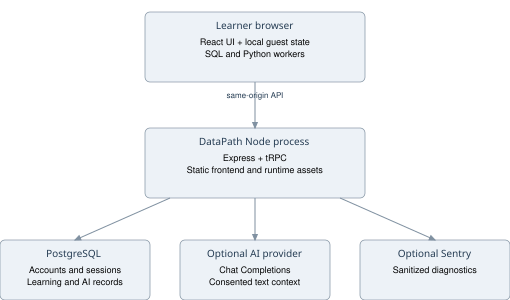

The browser owns the interactive learning workspace. React renders the interface, shared TypeScript functions generate plans and check learning state, and workers execute SQL and Python away from the main thread. Browser code calls the same-origin tRPC endpoint for authentication, account persistence and optional AI. Express serves both the API and built client assets from one long-running process. There is no separate frontend service required by the Docker design.

The server uses PostgreSQL for durable account data. An optional Chat-Completions-compatible service receives bounded coaching requests. An optional Sentry service receives sanitized diagnostics. Curated learning resource links point to external sites and open outside the core application. There is no vector database, queue broker, separate model server or background job service in the active application architecture.

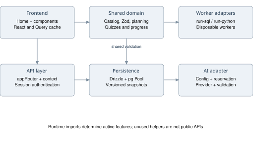

**Frontend.** client/src/App.tsx renders Home directly. Most navigation is React page state inside Home, not a collection of independently routed server pages. main.tsx installs the tRPC and TanStack Query providers, includes credentials in requests and uses SuperJSON serialization. Dialogs and other UI primitives are local shadcn-style components backed by Radix; Lucide supplies icons. Tailwind 4 and a substantial custom stylesheet define layout and themes.

**Shared domain.** shared/catalog.ts defines careers, skills, dependencies and topics. shared/learning.ts defines Zod state validation, planning, quiz construction and evidence summaries. Smaller modules isolate pace, practice, review, projects, exports and introductory learning. The same logic can execute in browser code and tests. Server-side shape validation does not make client-generated scores tamper-proof.

**Backend.** server/routers.ts is the mounted application router. server/db.ts owns the pool and account/legacy helpers; learning-store.ts persists snapshots; sessions.ts owns session token lifecycle; ai-budget.ts owns durable reservations. Files such as map, imageGeneration, voiceTranscription, notification and storage helpers exist in the repository but are not exposed by the current appRouter. Their presence is not proof of a user-facing feature.

Source: client/src/App.tsx; client/src/main.tsx; client/src/pages/Home.tsx; server/_core/index.ts; server/routers.ts.

## 3 Technology inventory

Versions below are dependency declarations from package.json; a caret is an allowed range, not a claim that every environment resolves the same patch. pnpm-lock.yaml is the reproducible installation source.

| Layer | Technology | Use |
| --- | --- | --- |
| Language | TypeScript 5.9.3 | Shared client, server and domain types |
| UI | React ^19.2.1; Vite ^7.1.7 | Rendering and build/dev tooling |
| Styling | Tailwind ^4.1.14; Radix; local UI components | Responsive layouts, dialogs and controls |
| Client data | TanStack Query ^5.90.2; tRPC ^11.6.0; SuperJSON ^1.13.3 | Typed calls, cache and serialization |
| Server | Express ^4.21.2; Node >=22.12 | HTTP process; Docker pins Node 24 image family |
| Validation | Zod ^4.1.12 | Environment, API and persisted state validation |
| Database | pg ^8.23.0; Drizzle ORM ^0.44.5 | PostgreSQL connection pool and queries |
| Migrations | drizzle-kit ^0.31.4 | Versioned PostgreSQL migrations |
| SQL runtime | @electric-sql/pglite 0.5.8 | In-memory PostgreSQL in a WASM worker |
| Python runtime | pyodide ^314.0.7 | Local Python execution in a worker |
| Testing | Vitest ^2.1.4; Playwright ^1.63.0 | Unit/runtime and browser smoke infrastructure |
| Diagnostics | Sentry client/server ^10.75.2 | Optional sanitized exception reporting |
| Packaging | pnpm 10.4.1; esbuild ^0.25.0; Docker | Locked install and one-process runtime image |

AlaSQL and mysql2 are not dependencies of the current package. The jose dependency remains installed, but application sessions are opaque database-backed tokens, not stateless JWT authentication. Installed packages can outlive active integrations; the mounted source determines actual behavior.

## 4 Product feature map

| Area | User and business purpose | Technical implementation |
| --- | --- | --- |
| Landing | Explain the journey and try a quick retail calculation | CareerLanding; sample challenge does not record progress |
| Onboarding | Choose a career or a single skill, industry and target depth | Profile schema; PathExplorer; deterministic requirements expansion |
| Career discovery | Compare roles by interest and coding preference | Curated catalog and scoring heuristic; no model call |
| Placement | Offer a starting-level signal | Authored question selection; contiguous level checks, no advanced exemption |
| Pace | Suggest a workable duration and allow overrides | Remaining hours, weekly baseline and 15 percent buffer |
| Overview | Show the next action, weekly budget and evidence | LearningDashboard; nextIntroStep; weeklyStudyPlan; progressEvidence |
| Introductory lessons | Teach records, filters, totals and averages without code | FirstLesson and per-industry FoundationsUnit state |
| Roadmap | Organize skills, levels, prerequisites and lesson completion | makePlan; LessonSteps; notes and quiz gates |
| Practice Lab | Apply learning to industry-shaped exercises | SQL/Python workers; formula/metric validators; self-review cases |
| Progress | Show what was completed and what evidence exists | Skill matrix, separate practice totals and selectable proof exports |
| Spaced review | Revisit weak skills and schedule follow-up checks | Quiz result updates; paired-skill reviews; interval heuristic |
| Resources | Find curated external guides, videos and optional paid resources | Catalog links and preference filters |
| Tools setup | Help learners prepare external software | Curated setup guidance; does not install software |
| Interview studio | Practise answers and reflect against a rubric | Curated question bank, timed practice, answer notes and journal export |
| Projects | Turn learning into a portfolio artifact | Role/skill blueprint, four milestones, CSV and self-review checklist |
| Career toolkit | Prepare a CV and track applications | CV fields, status/follow-up records, checklist and optional AI wording help |
| AI coach | Explain gaps and provide bounded guidance | Authenticated, consented coach procedure; no autonomous plan mutation |
| Settings | Manage profile, appearance, study time and backups | Local theme, workspace edits, JSON import/export, cloud save and remove |
| Accounts | Keep work across sessions/devices | Local scrypt accounts, optional compatible OAuth, DB sessions and revisions |

Not every displayed checkmark is independently verified. Time logging records learner-entered minutes; project completion and case rubrics are self-reviewed; practice checks test supplied fixtures. Resource quality and external availability can change independently of the application.

Source: client/src/pages/Home.tsx; client/src/components; shared/catalog.ts; shared/project-blueprint.ts.

## 5 Personalization and beginner learning flow

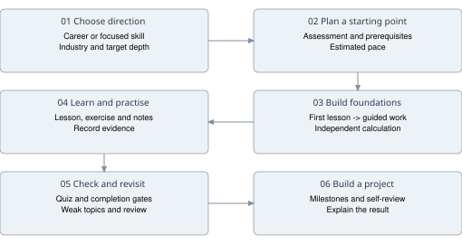

learningMode selects career or skill. Careers use recommended targets plus selected tools and overrides; focused paths use one skill and depth. Dependency expansion enforces prerequisite minimums. Topics are ordered by dependencies and filtered between the starting and target levels. A failed diagnostic resets the starting-level assumption to zero.

Completed topics reduce remaining effort unless flagged for review. Topic and incomplete-project hours determine duration and feasibility at the selected weekly pace. This is arithmetic over curated estimates, not a machine-learning prediction.

Suggested pace adds approximately 15 percent to remaining hours. New career learners start from four hours/week, experienced career learners from six; focused paths use three or five respectively. The function raises weekly hours when needed to fit the 104-week ceiling, subject to 60 hours/week. Users can change either duration or availability. Catch-up planning changes scheduling rather than silently completing activities.

New learners first identify three order rows, select completed records, total 180 and explain the rule. After completion, nextIntroStep sends them into the current industry's foundations unit. That unit proceeds through a worked example, guided calculations, an independent dataset and completion. Only after stage 3 does the overview recommend roadmap lessons. The weekly plan uses the same introductory decision. Changing industry can surface that industry's unfinished foundations work.

The weekly planner allocates the remaining Monday-to-Sunday budget after logged time: eligible reviews, then lessons/practice, then projects. Later activities remain locked until prerequisites finish. Logging time never completes an activity.

Source: shared/learning.ts requirements and makePlan; shared/pace.ts; shared/weekly-plan.ts; shared/intro-progress.ts; shared/foundations-unit.ts.

## 6 Assessments and progress semantics

| Evidence type | Rule | What it does not prove |
| --- | --- | --- |
| Topic quiz | Five questions; 80 percent pass | Independent professional assessment |
| Level quiz | Ten questions; 80 percent pass | Complete skill certification |
| Skill quiz | Twenty questions; 95 percent pass | Employment readiness or tamper resistance |
| Cumulative review | Last eligible topics from paired skills; 80 percent pass | An adaptive psychometric mastery estimate |
| Lesson completion | UI requires prerequisites, notes/evidence and a topic pass | That notes are true or original |
| SQL/Python pass | Result checks across fixtures | General correctness on all inputs |
| Applied case | Saved answer/rubric or checked arithmetic substeps | External-tool execution or expert approval |
| Project recorded | Completion flag plus nonempty notes in progress summary | Independent review of linked work |

recordQuizResult retains up to 500 attempts. Incorrect answers collect weak topic IDs, remove those topics from completed and can revoke certification for affected skills. A passing attempt removes recovered topics from review only when those questions were answered correctly. A pass does not automatically mark all topics complete. Latest quiz results and retained historical evidence are intentionally different views.

Review readiness groups required skills into pairs and preserves a final unpaired skill. Required skill passes unlock the review. Failed reviews or relevant weak topics are due immediately. Consecutive successful reviews on distinct UTC dates use intervals of 1, 3, 7, 14 and 30 days; repeated passes on one day do not advance multiple intervals. This is an explicit scheduling heuristic.

The skill matrix counts required lessons, nonempty evidence, level checks and latest skill score. Its proven label requires the skill in certifiedSkills plus evidence for all relevant topics. The platform explicitly distinguishes this application status from formal certification. Account save validates the LearningState structure, but does not recompute every client-supplied achievement server-side. Treat proof exports as learner records, not anti-cheat credentials.

Non-SQL practice keys are career-role:industry:exercise or skill-focus:industry:exercise. The current summary matches exact keys for current challenges, fixing focused paths that previously showed zero passes. SQL pass keys are industry:challenge; legacy unqualified SQL keys are treated as banking. Failed executed SQL or checked non-SQL attempts can add a review topic. A later practice pass records evidence, but review recovery follows quiz logic.

Source: shared/quiz-progress.ts; shared/review-readiness.ts; shared/review-schedule.ts; shared/progress-evidence.ts; shared/sql-progress.ts; shared/practice.ts.

## 7 Database storage architecture

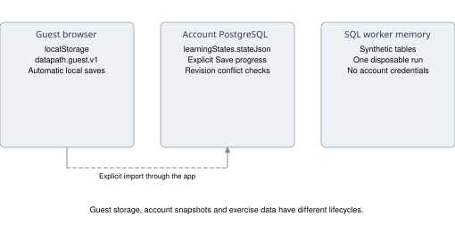

There are three distinct storage contexts. The backend PostgreSQL database holds account identity and durable snapshots. Browser localStorage holds the guest workspace under datapath.guest.v1 and theme under datapath.theme. The SQL worker creates a temporary in-memory PostgreSQL instance for synthetic exercises and terminates it after the run. None of the worker's practice tables are account tables.

The active learning model is a versioned JSON document serialized into a TEXT column, learningStates.stateJson. It is not JSONB and there are no normalized tables for current topics, quiz attempts, applications or projects. These collections are fields inside the snapshot. Zod validates their types and bounds on load/save. Keeping the document together simplifies reconstruction of one learner workspace, but limits queryability, analytics and independent updates.

The backend pool is lazy, with maximum 10 connections, 10-second connection acquisition timeout and 30-second idle timeout. Creating a pool does not itself establish successful database connectivity. Similarly, capabilities.accounts is based on the presence of DATABASE_URL, not a live health query. /api/health reports process liveness only.

Four retained legacy tables remain alongside the current model: workspaces, interviewQuestions, studySessions and skillProgressHistory. Their helpers and migrations are preserved. The mounted current learning API reads/writes learningStates rather than these legacy workspace fragments. Do not build new analytics assuming legacy tables mirror current learner activity.

Source: server/db.ts; server/learning-store.ts; client/src/lib/guest-storage.ts; drizzle/schema.ts.

## 8 Entity relationship diagrams

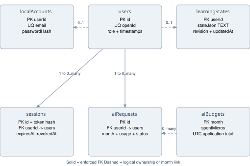

**Physical constraints.** Only sessions.userId and aiRequests.userId declare foreign keys to users.id, both ON DELETE CASCADE. localAccounts.userId and learningStates.userId are primary keys and logical ownership references, but no foreign key is declared. aiRequests.month logically maps to aiBudgets.month without an enforced foreign key. The diagram uses solid lines for declared foreign keys and dashed lines for logical links; crow-foot cardinalities are stated as text on each link.

A user can have zero or one local credential row and zero or one current learning snapshot, and many sessions and AI requests. These optional child counts are application-intended cardinalities; missing foreign keys permit orphan rows if SQL bypasses application code. aiBudgets has one row per UTC month and accounts for many requests across users.

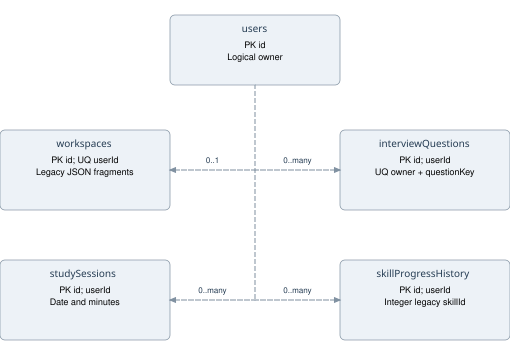

The legacy ownership links are logical only. workspaces.userId is unique, enforcing at most one legacy workspace per userId value. interviewQuestions enforces uniqueness for the pair userId and questionKey. studySessions and skillProgressHistory allow many rows per owner. skillProgressHistory.skillId is an integer legacy identifier, whereas current catalog skills use string IDs; it is not a physical FK to the current catalog.

Database deletion semantics should not be inferred from diagrams alone. The application remove procedure deletes a learningStates row, not the user identity or all related records. There is no mounted account-deletion endpoint that cascades through all retained data.

## 9 Data dictionary

The following dictionary is generated from drizzle/schema.ts metadata. PK means primary key; UQ means uniqueness; identity means GENERATED BY DEFAULT AS IDENTITY. Nullable fields are marked Yes. SQL defaults and timestamp trigger behavior are described below the tables. Quoted camelCase identifiers are intentional and matter when writing raw PostgreSQL SQL.

### users

| Column | PostgreSQL type | Nullable | Constraints and default |
| --- | --- | --- | --- |
| id | integer | No | PK; identity |
| openId | varchar(64) | No | UQ |
| name | text | Yes | - |
| email | varchar(320) | Yes | - |
| loginMethod | varchar(64) | Yes | - |
| role | user_role | No | default user |
| createdAt | timestamp with time zone | No | default now() |
| updatedAt | timestamp with time zone | No | default now() |
| lastSignedIn | timestamp with time zone | No | default now() |

### localAccounts

| Column | PostgreSQL type | Nullable | Constraints and default |
| --- | --- | --- | --- |
| userId | integer | No | PK |
| email | varchar(320) | No | UQ |
| passwordHash | varchar(255) | No | - |
| createdAt | timestamp with time zone | No | default now() |

### learningStates

| Column | PostgreSQL type | Nullable | Constraints and default |
| --- | --- | --- | --- |
| userId | integer | No | PK |
| stateJson | text | No | - |
| revision | integer | No | default 1 |
| updatedAt | timestamp with time zone | No | default now() |

### sessions

| Column | PostgreSQL type | Nullable | Constraints and default |
| --- | --- | --- | --- |
| id | varchar(64) | No | PK |
| userId | integer | No | FK users.id; delete cascade |
| expiresAt | timestamp with time zone | No | - |
| revokedAt | timestamp with time zone | Yes | - |

### aiBudgets

| Column | PostgreSQL type | Nullable | Constraints and default |
| --- | --- | --- | --- |
| month | varchar(7) | No | PK |
| spentMicros | bigint | No | default 0 |

### aiRequests

| Column | PostgreSQL type | Nullable | Constraints and default |
| --- | --- | --- | --- |
| id | varchar(36) | No | PK |
| userId | integer | No | FK users.id; delete cascade |
| month | varchar(7) | No | - |
| model | varchar(200) | No | - |
| reservedMicros | bigint | No | - |
| chargedMicros | bigint | Yes | - |
| status | varchar(20) | No | default reserved |
| promptTokens | integer | Yes | - |
| completionTokens | integer | Yes | - |
| createdAt | timestamp with time zone | No | default now() |

### workspaces

| Column | PostgreSQL type | Nullable | Constraints and default |
| --- | --- | --- | --- |
| id | integer | No | PK; identity |
| userId | integer | No | UQ |
| profileJson | text | No | - |
| skillsJson | text | No | - |
| projectsJson | text | No | - |
| sqlJson | text | No | - |
| studyLogJson | text | No | - |
| weeklyGoal | integer | No | default 5 |
| theme | varchar(16) | No | default light |
| timerRemaining | integer | No | default 1500 |
| timerSessions | integer | No | default 0 |
| createdAt | timestamp with time zone | No | default now() |
| updatedAt | timestamp with time zone | No | default now() |

### interviewQuestions

| Column | PostgreSQL type | Nullable | Constraints and default |
| --- | --- | --- | --- |
| id | integer | No | PK; identity |
| userId | integer | No | - |
| questionKey | varchar(64) | No | - |
| category | varchar(120) | No | - |
| question | text | No | - |
| why | text | No | - |
| followUp | text | No | - |
| answerNote | text | Yes | - |
| feedbackJson | text | Yes | - |
| createdAt | timestamp with time zone | No | default now() |
| updatedAt | timestamp with time zone | No | default now() |

### studySessions

| Column | PostgreSQL type | Nullable | Constraints and default |
| --- | --- | --- | --- |
| id | integer | No | PK; identity |
| userId | integer | No | - |
| sessionDate | varchar(10) | No | - |
| minutes | integer | No | default 25 |
| createdAt | timestamp with time zone | No | default now() |

### skillProgressHistory

| Column | PostgreSQL type | Nullable | Constraints and default |
| --- | --- | --- | --- |
| id | integer | No | PK; identity |
| userId | integer | No | - |
| skillId | integer | No | - |
| skillName | varchar(180) | No | - |
| status | varchar(40) | No | - |
| recordedAt | timestamp with time zone | No | default now() |

All createdAt, updatedAt, lastSignedIn and recordedAt fields have now() defaults where defined in the schema. expiresAt and revokedAt have no automatic now() defaults. The user_role enum allows user and admin. aiRequests.status defaults to reserved; the code later writes settled or unknown, but there is no database enum or CHECK constraint restricting this varchar.

Additional indexes: sessions_user_idx(userId), sessions_expiry_idx(expiresAt), ai_requests_user_time_idx(userId, createdAt), and unique interview_owner_question_idx(userId, questionKey). Primary and unique constraints also create indexes. There is no standalone AI month foreign key or explicit JSON-path index.

The datapath_touch_updated_at trigger function updates updatedAt when a row changes and the caller did not explicitly change that timestamp. It is attached to users, workspaces, interviewQuestions and learningStates. Explicit historical timestamps are preserved. The migration directory also contains Drizzle metadata; migration bookkeeping is not one of the 10 domain tables.

Source: drizzle/schema.ts; drizzle/postgres/0000 and subsequent SQL migrations.

## 10 LearningState document model

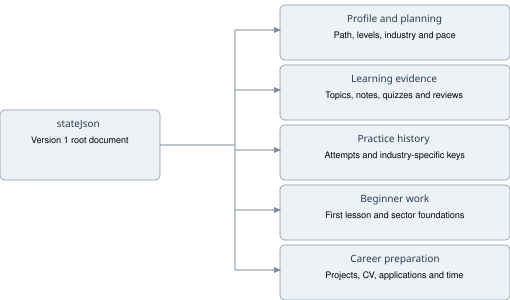

The state version is fixed at 1. Schema defaults allow older compatible snapshots to acquire newer optional collections. The client and server use the same learningStateSchema. A schema-valid state is not necessarily an independently verified learning history.

| Field or group | Representation and bound |
| --- | --- |
| profile | Career/focus, targets, industry, language, pace, interests and self-assessment |
| firstLesson | Optional step 0-4; completed must equal step === 4 |
| foundationUnits | Optional per-industry stage 0-3 and four answer strings |
| completed and reviewTopics | Valid topic ID arrays, bounded by current catalog topic count |
| evidence | Topic ID to note string, maximum 1,000 characters per note |
| diagnostics | Skill ID to up to three answer indexes |
| quizAttempts | Up to 500 attempts; kind, target, score, pass, weak topics and ISO time |
| certifiedSkills | Up to 28 valid skill IDs |
| practiceAttempts | Last 30; keyed context, answer <=4,000 chars, feedback <=500, rubric/checkpoints |
| completedPracticeIds | Up to 300 durable keyed pass records |
| labAttempts | Last 50 SQL attempts; query <=4,000 chars, checks and feedback |
| passedLabIds | Durable SQL pass IDs, bounded by SQL challenge count times industry count |
| interviewAnswers | Up to 100 keys, each answer <=5,000 chars |
| completedProjects and projectNotes | Valid career/focus project IDs; notes <=5,000 chars, <=30 note keys |
| applications | Up to 100 company/role/status/follow-up records |
| cv | Name <=100, summary <=2,000, achievements <=4,000, links <=2,000 chars |
| jobChecklist | Up to 20 string IDs |
| sessions | Up to 365 self-reported date/minute entries; 1-480 minutes each |
| onboarded | Boolean controlling whether a configured workspace exists |

Profile limits include 1-104 weeks, 1-60 hours/week, skill targets 1-3, assessment levels 0-3, and an avatar data URL of at most 35,000 characters restricted to PNG/JPEG/WebP prefixes. An account snapshot has a stricter combined UTF-8 size ceiling of 60,000 bytes. Individual field limits do not guarantee the combined snapshot fits. The client checks this before save and the server enforces it again.

Theme is a separate browser preference, not a field in current LearningState. Many ephemeral UI values such as open disclosures, current page, timer state, current AI reply and checklist interaction state are not equivalent to persisted learning fields. Inspect the owning component before promising cross-device persistence for a new UI control.

## 11 Account authentication and session lifecycle

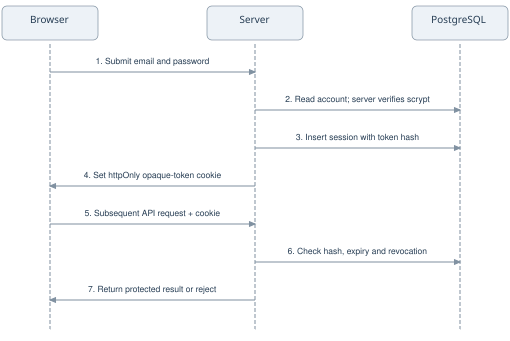

Registration trims and lowercases email, requires a 2-80 character name and a 10-128 character password. It generates a 16-byte random salt and a 64-byte scrypt-derived password hash, stored in a scrypt$salt$hash representation. Local user and credential creation are transactional. Login compares the derived hash with timingSafeEqual and returns a generic invalid-email-or-password error for incorrect credentials.

The cookie contains a 32-byte random base64url token. PostgreSQL stores only its SHA-256 hex digest as sessions.id, with userId, expiresAt and nullable revokedAt. The default maximum lifetime is one year. Each authenticated request resolves the cookie through the database and checks expiry and revocation; the token is not a self-contained JWT. Logout revokes that session before clearing the cookie; revokeAllSessions revokes every active session belonging to the authenticated user.

The cookie name is app_session_id with httpOnly, path / and SameSite=Lax. Secure is always true in production and also used when the request is detected as HTTPS. Local HTTP test sessions can use non-secure cookies. A context lookup error results in no authenticated user, so protected procedures reject access. The UI handles logout failure and preserves the workspace for retry.

An optional Manus-compatible OAuth callback exchanges a code, obtains user information, upserts the user and issues the same opaque database session. A one-time nonce cookie binds state to the initiating browser. This is not a generic Google OAuth implementation. OAuth needs both configured URLs, an app ID and the database. Password reset, email verification and multi-factor authentication are not implemented by the mounted router.

Source: server/routers.ts; server/sessions.ts; server/_core/context.ts; server/_core/cookies.ts; server/_core/oauth.ts; server/db.ts.

## 12 Saving guest and account progress

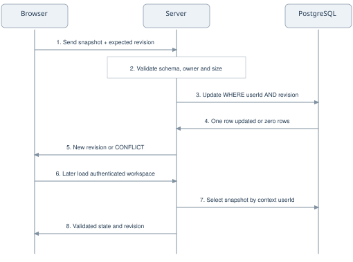

Guests are saved automatically in localStorage. Reading invalid guest state falls back to a new state, while writing preserves the unreadable original under a numbered recovery key before replacing it. Export/import offers a separate backup path. Browser storage is origin-specific; switching browsers, clearing site data or using a different port does not automatically transfer guest work.

Signed-in work remains in the client until Save progress is selected. The UI tracks dirty state, distinguishes owners, scopes account query caches and uses a workspace epoch to ignore stale asynchronous updates after an owner switch. A new empty account can explicitly import an onboarded guest workspace; the original guest save remains intact. An existing account is not silently overwritten by guest state.

For revision 0, the server inserts a snapshot with revision 1; duplicate insertion returns CONFLICT. Otherwise it updates only where both userId and revision match, then increments revision. A zero-row update returns CONFLICT, preventing silent last-writer-wins overwrite. Ownership always comes from the authenticated context; the optional load scope must match that user. There is no automatic multi-device merge or offline account synchronization.

On a conflict or save failure, preserve the local work, export a backup, and reload/reconcile deliberately. Deleting learning progress removes the current snapshot, not the account or AI accounting records. Backups may contain CV text, notes, names and application information and should be treated as personal data.

Source: server/learning-store.ts; client/src/pages/Home.tsx; client/src/lib/guest-storage.ts.

## 13 API reference

All procedures below are mounted under /api/trpc using the tRPC Express adapter and SuperJSON. Queries are read operations; mutations change state or invoke a provider. These are typed tRPC contracts, not a separate REST/OpenAPI implementation. The client uses httpBatchLink and includes cookies.

| Procedure | Access | Contract and result |
| --- | --- | --- |
| auth.me | Public query | No input; current user or null |
| auth.register | Public mutation | name, normalized email, password; creates local account and session cookie; success |
| auth.login | Public mutation | email, password; validates credentials and creates session; success |
| auth.logout | Public mutation | Revokes cookie session and clears cookie; success |
| auth.revokeAllSessions | Protected mutation | Revokes current user's sessions and clears cookie; success |
| datapath.catalog | Public query | Catalog version, careers and skills |
| datapath.capabilities | Public query | ai/accounts/oauth configured flags; not connectivity probes |
| datapath.load | Protected query | Optional positive scope matching user; null or state and revision |
| datapath.save | Protected mutation | Valid LearningState and nonnegative revision; new revision |
| datapath.remove | Protected mutation | Deletes authenticated user's learning snapshot; success |
| datapath.coach | Protected mutation | State, message 3-2,000 chars, mode, optional questionId, consent=true; message and topicIds |

| HTTP route | Purpose |
| --- | --- |
| GET /api/health | Liveness response with status ok and app DataPath; no DB check |
| GET /api/oauth/callback | Configured OAuth code/state callback; redirect to / on success |
| /api/trpc | Mounted typed application API |
| Static assets and SPA fallback | Built client and local SQL/Python runtime files |

Relevant failures include UNAUTHORIZED for missing sessions, FORBIDDEN for mismatched account scope, CONFLICT for stale revisions/duplicate accounts, PAYLOAD_TOO_LARGE above 60 KB, SERVICE_UNAVAILABLE when database/provider configuration is absent, TOO_MANY_REQUESTS for limits and BAD_GATEWAY for invalid/unavailable AI results. Internal error messages are generalized and production stack traces omitted by the tRPC formatter. Registration currently maps its caught failures to a duplicate-account conflict, so that response alone is not a reliable diagnosis of every database error.

## 14 SQL practice execution

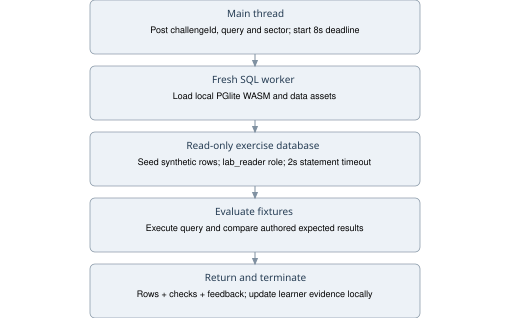

runSqlInWorker creates a fresh module worker for each submission and posts {challengeId, query, sector}. The public response includes passed, executed, columns, rows, checks and message, with optional error, coaching and resultFeedback. The worker loads pglite.wasm, initdb.wasm and pglite.data from /sql-runtime. Preparation scripts copy these from the locked dependency before dev/build; no runtime CDN is required.

The engine creates a disposable in-memory PostgreSQL instance. It seeds two synthetic tables using PostgreSQL DDL and parameterized inserts. Banking vocabulary uses customers(customer_id INTEGER, customer_name TEXT, segment TEXT) and transactions(transaction_id INTEGER, customer_id INTEGER, amount INTEGER, status TEXT, transaction_date DATE). Industry mapping can expose entities/events and corresponding labels. These are deliberately small teaching tables, with no relationship to the production user schema.

Queries must begin with SELECT or WITH, contain one statement and stay within 4,000 characters. A conservative lexical filter blocks mutation/file/scripting terms and some valid PostgreSQL syntax; this is a restricted learning subset, not a full SQL console. Database controls provide an additional boundary: a non-superuser lab_reader receives SELECT access, schema creation and set_config execution are restricted, and execution occurs inside a read-only transaction with a 2,000ms statement timeout, followed by rollback.

The outer worker limit is eight seconds including initialization. The evaluator compares query results with authored expected results and alternate fixtures, including boundaries, altered input and empty data. Result order and column names matter according to the challenge comparison. PGlite executes PostgreSQL semantics rather than emulating AlaSQL. Workers terminate after results/errors/timeouts; no database persists across submissions.

Production worker-specific CSP permits only the listed local SQL runtime fetches and disallows child workers. Client-side execution and fixture visibility still mean these checks are educational feedback, not secure examinations. Large runtime downloads can affect first-run latency and low-memory mobile browsers.

Source: client/src/lib/run-sql.ts; client/src/lib/sql-worker.ts; shared/sql-engine.ts; shared/sql-lab.ts; server/security.ts.

## 15 Python and other practice formats

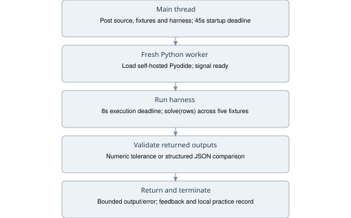

Python practice lazily starts /python-worker.js. The worker imports locally hosted Pyodide, supplies an empty jsglobals object and runs a curated harness with the learner source and fixtures. It sends ready after runtime startup; the client uses a 45-second loading deadline, then an eight-second execution deadline. Each run ends by terminating its worker. It does not run learner Python on the Express server.

The normal task contract is solve(rows), with challenge-specific harness behavior for one-pass streaming tasks. Five fixture datasets cover the visible case, changed values/order, empty input, zero/missing/pending values and grouping/tie/negative cases. Numeric results use a 1e-8 comparison tolerance; structured outputs compare JSON serialization. The worker bounds returned output to 10,000 characters and error text to 1,000; UI guidance further limits displayed error tails. Passing the profiling exercises checks output, not a measurement of memory complexity.

Production CSP restricts worker network access to local Python runtime assets and disallows child workers. The Python worker allows eval/WASM directives required by its runtime; it is not a general adversarial code sandbox or proof of complete isolation. No authenticated account API access is intended for learner code. Runtime restrictions should be reverified under production headers whenever execution code changes.

Excel and DAX tasks check supported formula/measure shapes and fields using application validators; they do not embed Excel or Power BI. Metric tasks check numerical answers and definitions. Applied cases record notes, rubric selections and optional industry arithmetic checkpoints, with explicit self-review status. ETL, dbt, Airflow and Spark cases require external tools for genuine execution. The app does not start those external systems or certify their outputs.

Source: client/src/lib/run-python.ts; client/public/python-worker.js; shared/python-practice.ts; shared/python-feedback.ts; shared/practice.ts; scripts/prepare-python.mjs.

## 16 AI architecture and exact behavior

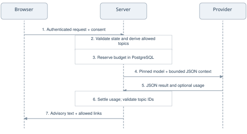

AI assists with coaching, interview feedback and CV wording. It requires authentication, consent=true, valid inputs, provider configuration and budget. It does not generate the curriculum or grade code; curated lessons and local practice work without it.

The server builds two messages: a system instruction and a JSON user-context message. It derives up to 40 unfinished topics from makePlan and includes their IDs and bilingual titles. Context includes mode/request, learning mode, career role or focused skill, required target levels, experience, goals, role description, motivation, tools, expertise and self-assessment. Interview mode includes the selected curated question and rubric; an unknown question ID is rejected. CV mode includes the complete cv object. The full state reaches the server for validation/context construction, but not every field is forwarded to the provider. Notably, sector is not explicitly included in the provider payload, and no lesson bodies, resource retrieval or full attempt history are supplied.

The model must equal configured AI_MODEL. No vendor model is hardcoded or configured in the inspected environment. The adapter appends /v1/chat/completions to BUILT_IN_FORGE_API_URL, defaulting to the existing Forge endpoint when no base URL is set. A provider must support this JSON-schema contract; Chat Completions compatibility alone is insufficient.

Calls are text-only, with at most 1,800 output tokens and a strict JSON schema containing message and topicIds. Zod then limits messages to 6,000 characters and IDs to five, all from the supplied allowed set. Results are advisory text and links. No tools are supplied: the model cannot execute code, browse, change plans or save progress. Replies live in UI state, not a conversation table.

**What this is not.** There is no embedding pipeline, vector search, RAG document retrieval, fine-tuning pipeline, model training, autonomous agent loop, automated credentialing or external web grounding in the active AI path. Mentioning Generative AI/RAG as a curriculum skill does not imply the product itself implements RAG. System instructions discourage invented experience and unsupported outcomes, but those instructions and schema checks do not guarantee factual correctness.

Source: server/routers.ts datapath.coach; server/_core/llm.ts; server/ai-config.ts; server/ai-documentation-audit.test.ts.

## 17 AI reliability and spending controls

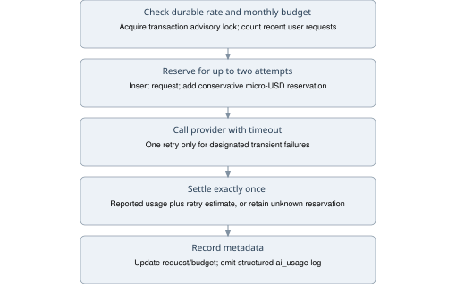

The HTTP adapter keeps an AbortController timeout active through response-body parsing. AI_TIMEOUT_MS defaults to 25,000ms, with a 100-60,000ms range. It makes at most two attempts: one initial attempt and one retry for timeout, network TypeError, HTTP 429 or HTTP 5xx. Other HTTP failures are not retried. Retry delay is 500ms, or numeric Retry-After clamped to 500-2,000ms. A retry can consume additional provider tokens; it is not an idempotent billing guarantee.

There are two AI rate controls: an in-process 20-requests/hour router guard and a durable per-user rolling-hour check whose configured maximum is 1-20. A global PostgreSQL advisory transaction lock serializes reservation and settlement, including per-user rate checking. aiBudgets stores an application-wide UTC calendar-month amount in integer micro-USD, including unsettled reservations; it is not a separate allowance per learner.

For one potential provider attempt, the reservation estimate is ceil((UTF-8 request bytes + 1,024) multiplied by input USD-per-million + output-token limit multiplied by output USD-per-million), expressed in micro-USD. The request reserves twice that amount for a possible retry. Admission is rejected if the current monthly amount plus reservation exceeds the configured cap. Pricing inputs are required and positive; there is no guessed default price.

Settlement uses valid nonnegative integer usage counts from the returned provider result. It charges reported prompt/completion tokens at configured prices plus a conservative per-attempt estimate for earlier retries. Missing or invalid usage keeps the full reservation with status unknown. Settlement changes a reserved row only once. If the process dies before settlement, its reservation remains conservative; no automatic reconciliation worker is implemented. Provider billing accuracy still depends on chosen rates, tokenizer assumptions and trustworthy usage metadata, so the cap is an application control rather than a contractual guarantee against every provider bill.

Structured ai_usage logs contain request ID, numeric user ID, month, model, attempt count, status, charged micro-USD and token counts. They do not include prompt or CV text. aiRequests records accounting metadata, not complete conversations. An operator still needs retention and reconciliation procedures for these records.

Source: server/ai-budget.ts; server/ai-config.ts; server/_core/llm.ts; TASK_5_AI_HARDENING.md.

## 18 Security privacy and trust boundaries

The API applies 120 requests/minute per IP in a process-local map; local authentication has a separate 20 attempts/hour/IP map. These maps reset on restart and are not distributed across replicas. Writes reject mismatched Origin and cross-site Sec-Fetch-Site. Production writes without Origin are rejected unless an Authorization header is present; protected tRPC procedures still authenticate via the session cookie. Body parsers accept up to 128 KB, while learning snapshots have the lower 60,000-byte store limit.

Headers include nosniff, strict-origin-when-cross-origin referrers, DENY framing and disabled camera/microphone/geolocation permissions. Production adds HSTS and separate CSPs for the document and each worker. The document permits same-origin scripts, local connections plus the configured Sentry ingest origin, and inline styles. These headers are production-mode behavior; a development preview is not equivalent security validation.

Sentry is optional on both client and server, with default PII disabled and tracing sample rate zero. sanitizeTelemetry removes user, request, extra, contexts and breadcrumbs, replaces free-form message/error text, and retains diagnostic structure such as stack/type. This reduces exposure but is not a complete privacy compliance program. Server console logging is a separate channel; for example, OAuth callback errors are logged by that callback.

Do not place server provider keys in VITE_ variables: those are build-time client values. Never run the disposable integration scripts against real learner databases. Raw SQL administration must account for the logical-only foreign keys. Password reset, email verification, MFA, administrative deletion, retention automation, audit-log access control and tested production restore procedures are outstanding operational features, not completed capabilities.

The current product is designed for learning, not high-stakes certification. Learner-controlled snapshots can contain manufactured completion flags even if their structure validates. Stronger proof would require trusted server-side grading and a signed evidence model; that would be a separate design change.

## 19 Deployment and configuration

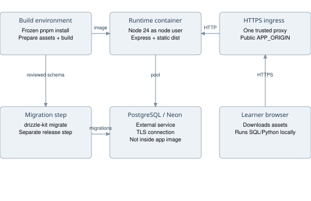

The existing Dockerfile uses a Node 24 Debian slim build stage, installs pnpm 10.4.1, installs the frozen lockfile, prepares runtimes, builds Vite/esbuild output and prunes development dependencies. The runtime stage copies package.json, production node_modules and dist, runs as the node user and exposes port 3000. One Node process serves API and frontend assets. PostgreSQL remains external to this container.

The container starts with node --import ./dist/instrument.js dist/index.js. /api/health is the Docker health-check target. SIGTERM/SIGINT close the HTTP server, database pool and Sentry with a ten-second shutdown deadline. Development can search for another port; production/test use the configured port directly. The normal app was not launched or deployed as part of producing this document.

| Environment variable | Purpose and validation |
| --- | --- |
| NODE_ENV | development, test or production; default development |
| PORT | Integer 1-65535; default 3000 |
| APP_ORIGIN | Canonical origin without path/trailing slash; HTTPS mandatory in production |
| TRUST_PROXY | 0 or 1; set 1 only behind exactly one trusted reverse proxy |
| DATABASE_URL | Optional for guests; PostgreSQL URL required for accounts and AI accounting |
| DATABASE_MIGRATION_URL | Optional migration connection, falling back to DATABASE_URL |
| VITE_APP_ID; VITE_OAUTH_PORTAL_URL; OAUTH_SERVER_URL | Optional compatible OAuth group; all plus DB required together |
| OWNER_OPEN_ID | Optional owner identification used by user upsert |
| BUILT_IN_FORGE_API_URL; BUILT_IN_FORGE_API_KEY | Provider base URL and secret server key |
| AI_MODEL | Required explicit model when AI key is set; 1-200 characters |
| AI_INPUT_USD_PER_MILLION; AI_OUTPUT_USD_PER_MILLION | Required positive verified prices, maximum 1,000 |
| AI_MONTHLY_CAP_USD | Required positive application cap, maximum 10,000 |
| AI_TIMEOUT_MS | Default 25,000; accepted 100-60,000 |
| AI_REQUESTS_PER_HOUR | Default 20; accepted 1-20 |
| SENTRY_DSN | Optional server runtime reporting destination |
| VITE_SENTRY_DSN | Optional public client DSN supplied at build time; also align runtime CSP configuration |

Zod parses environment configuration at boot and rejects invalid combinations. A production DATABASE_URL value containing a shell command, surrounding assignment or placeholder is invalid; it must be the actual connection URI. Production APP_ORIGIN must be the public HTTPS origin. No secret values should appear in the repository, build arguments or this document.

Neon is the intended hosted database. The project's configuration notes require verified TLS and suggest a pooled application connection and optional direct/unpooled migration connection to the same logical database. No provider plan, pricing, availability or production connection is promised here. Hosting remains deferred by the project owner.

Source: Dockerfile; .dockerignore; .env.example; server/_core/env.ts; server/_core/index.ts; TASK_2_POSTGRES.md.

## 20 Migrations and operator runbook

Migration generation uses drizzle/schema.ts and writes to drizzle/postgres with dialect postgresql. The sequence creates the initial seven tables, adds timestamp triggers, adds sessions and adds AI accounting. Old MySQL migration files are historical artifacts and are not the configured runner input. The Docker runtime does not include the migration source or a startup migration command; migrations are a separate release step from a checkout/build environment containing drizzle-kit.

**Local guest development.** Install a supported Node version and the pinned pnpm, run pnpm install --frozen-lockfile, then pnpm dev. The predev step copies SQL/Python assets. With no database/provider configuration, guests can use curated learning and local practice; account features are unavailable. Use the printed port rather than assuming 3010 is always running.

**Enable local accounts.** Supply DATABASE_URL for an intended local PostgreSQL database through the environment, review the migrations, run pnpm db:migrate, and launch the app. Do not reuse the disposable integration database for real learner work. A declared URL does not mean the server is reachable; test registration/save/load against that environment and verify migrations were applied.

**Release preparation.** Back up the destination database; review schema changes and migrations; apply migrations once using the intended migration URL; run checks; build the image; set production environment; start behind HTTPS; verify liveness, account writes, save/reload and worker asset downloads. A liveness 200 alone does not prove DB/provider readiness. Keep the previous image available, but assess migration compatibility before rolling back code.

**Backup and recovery.** The application offers learner JSON export/import, which is not a database backup. Operator-level PostgreSQL backup/restore and Neon recovery settings require a separately verified process. Test recovery in a nonproduction database, preserve identity sequence state when importing old numeric IDs, and do not assume logical-only relationships will be enforced for imported records.

**Troubleshooting.** Invalid environment errors are boot configuration problems; fix the named variable. A missing accounts flag indicates no DATABASE_URL, not a UI theme issue. Save conflicts indicate stale revision or another workspace creation; export local work before reload. Worker startup failures require verifying the self-hosted asset paths and CSP, not installing SQL or Python on the server. AI unavailable can mean configuration, authentication, rate limit, cap, timeout or rejected response; inspect sanitized accounting and application logs without exposing prompts.

## 21 Testing and acceptance evidence

| Check | Coverage and current evidence |
| --- | --- |
| pnpm test | 282 tests in 40 files; rerun while generating this reference |
| pnpm check | TypeScript validation; passed in latest code quality pass |
| pnpm build | Production frontend/backend build; passed in latest code quality pass |
| pnpm test:integration | Explicit disposable PostgreSQL only; sessions, account isolation, revision races, migrations and persistence passed in latest quality pass |
| pnpm test:sql-worker | Built worker/industry fixture verification; historical verified coverage 126 combinations |
| pnpm test:python-runtime | Self-hosted runtime/industry verification; historical verified coverage 54 combinations |
| pnpm test:ai-budget | Dedicated database accounting checks; run against a disposable DB, not a live provider billing test |
| pnpm test:launch | Launch/environment/header tooling; separate from production acceptance |
| pnpm test:smoke | Playwright signup -> SQL -> Python -> save infrastructure exists; not rerun for this document |

The checked-in smoke test includes selectors tied to earlier onboarding text, so its existence must not be presented as current browser acceptance. The recent manual browser pass used an isolated local origin and disposable account: registration and invalid login, account/guest separation, short-screen dialogs, introduction and foundations, SQL quiz/lesson completion, failed/passed metric practice, save/reload and logout/login restoration. The preceding responsive pass checked 11 main destinations at 360, 768 and 1440px in both themes.

AI contract tests use a mock provider to verify bounded context, focused-path semantics, CV inclusion, model selection and returned-topic validation. They are not evidence of live model accuracy, acceptable hallucination rates, real provider availability or exact production cost. SQL/Python fixtures also cannot prove correctness for every possible program/input.

## 22 Known limits and engineering priorities

The main operational gap is a configured, verified normal database connection and deployment, not missing PostgreSQL implementation. The current JSON snapshot model has a 60 KB ceiling, manual account saves and conflict rejection rather than merge. Several ownership relationships are logical-only, and legacy tables remain. A schema normalization project would require a migration plan and compatibility strategy; it is not part of this documentation change.

Curriculum coverage is uneven across 254 topics. Some lessons use general prompts instead of authored worked examples; some specialist topics have no executable lab. ETL/dbt/Airflow/Spark case coverage is self-reviewed. See CONTENT_AUDIT.md for per-path counts. Arabic/RTL content and worked-example parity require dedicated acceptance work.

Before launch, verify the intended PostgreSQL/Neon connection, refresh stale smoke selectors, perform a real restore rehearsal, verify production CSP/worker behavior and review authentication recovery needs. Before marketing AI-specific claims, choose and configure a provider/model, run a representative evaluation set, test JSON-schema compatibility, and validate prices and usage reconciliation. These are recommendations, not claims that those checks have already passed.

## 23 Source map and catalog appendices

Repository paths identify the implementation behind the preceding claims. They are relative to the DataPath repository so the reference can travel with a checkout. Code baseline 88c1d89 is the implementation snapshot; later code changes may invalidate details.

| Concern | Primary source |
| --- | --- |
| UI and account ownership | client/src/pages/Home.tsx; client/src/main.tsx |
| Domain profile and schema | shared/learning.ts; shared/catalog.ts |
| Current SQL schema | drizzle/schema.ts; drizzle/postgres/*.sql |
| DB connection and account creation | server/db.ts |
| Versioned saves | server/learning-store.ts; client/src/lib/guest-storage.ts |
| Authentication | server/routers.ts; server/sessions.ts; server/_core/sdk.ts |
| HTTP security and environment | server/security.ts; server/_core/env.ts; server/_core/cookies.ts |
| Introductory routing | shared/intro-progress.ts; FirstLesson.tsx; FoundationsUnit.tsx |
| Planning and review | shared/pace.ts; weekly-plan.ts; quiz-progress.ts; review-schedule.ts |
| SQL and Python | shared/sql-engine.ts; client/src/lib/run-sql.ts; run-python.ts; client/public/python-worker.js |
| AI | server/routers.ts; server/_core/llm.ts; ai-config.ts; ai-budget.ts |
| Diagnostics | shared/telemetry.ts; server/_core/instrument.ts; client/src/lib/telemetry.ts |
| Deployment | Dockerfile; drizzle.config.ts; .env.example; package.json |
| Coverage and history | VALIDATION.md; CONTENT_AUDIT.md; ENGINEERING_CONTENT.md; server/*.test.ts |

### Career inventory

| Career ID | Name |
| --- | --- |
| data-analyst | Data Analyst |
| bi-analyst | BI Analyst |
| business-analyst | Data Business Analyst |
| product-analyst | Product Analyst |
| analytics-engineer | Analytics Engineer |
| data-engineer | Data Engineer |
| cloud-data-engineer | Cloud Data Engineer |
| data-architect | Data Architect |
| database-admin | Database Administrator |
| data-scientist | Data Scientist |
| ml-engineer | Machine Learning Engineer |
| ai-engineer | AI Engineer |
| genai-engineer | Generative AI Engineer |
| mlops-engineer | MLOps Engineer |
| governance-specialist | Data Governance Specialist |
| quality-analyst | Data Quality Analyst |
| data-steward | Data Steward |
| data-product-manager | Data / AI Product Manager |
| marketing-data-analyst | Marketing Data Analyst |
| risk-data-analyst | Risk Data Analyst |
| bi-developer | BI Developer |
| data-platform-engineer | Data Platform Engineer |

### Skill inventory

| Skill ID | Name | Topics |
| --- | --- | --- |
| sql | SQL | 10 |
| python | Python | 10 |
| excel | Excel | 9 |
| statistics | Statistics | 9 |
| cleaning | Data cleaning | 9 |
| powerbi | Power BI | 9 |
| tableau | Tableau | 9 |
| storytelling | Data storytelling | 9 |
| business | Business analysis | 9 |
| experimentation | Experimentation | 9 |
| modeling | Data modeling | 9 |
| pipelines | ETL / ELT | 9 |
| dbt | dbt | 9 |
| airflow | Airflow | 9 |
| spark | Apache Spark | 9 |
| kafka | Streaming / Kafka | 9 |
| cloud | Cloud platforms | 9 |
| engineering | Git, Linux & Docker | 9 |
| ml | Machine learning | 9 |
| deep | Deep learning | 9 |
| genai | Generative AI / RAG | 9 |
| mlops | MLOps | 9 |
| governance | Data governance | 9 |
| quality | Data quality | 9 |
| architecture | Data architecture | 9 |
| database | Database administration | 9 |
| product | Data product management | 9 |
| privacy | Privacy & responsible AI | 9 |

### Industry inventory

| Industry ID | Display name |
| --- | --- |
| banking | Banking |
| finance | Finance & investment |
| marketing | Marketing & advertising |
| healthcare | Healthcare |
| retail | Retail & e-commerce |
| technology | Technology & SaaS |
| telecom | Telecommunications |
| government | Government & public services |
| general | Not sure / cross-industry |

### SQL challenge inventory

| SQL challenge ID | Topic | Title |
| --- | --- | --- |
| sql-select-filter | sql-1 | Filter high-value completed transactions |
| sql-group-revenue | sql-2 | Calculate completed revenue by customer |
| sql-join-customer-value | sql-3 | Build a customer-value review list |
| sql-date-range | sql-1 | Find payments in a date range |
| sql-distinct-segments | sql-6 | Remove duplicate customer segments |
| sql-debug-boolean | sql-1 | Debug an overly broad payment filter |
| sql-debug-count | sql-2 | Debug payment counts |
| sql-left-join | sql-3 | Find customers without completed payments |
| sql-subquery | sql-4 | Find above-average payments |
| sql-cte | sql-4 | Create a reusable revenue stage |
| sql-window | sql-5 | Rank completed payments |
| sql-null | sql-6 | Debug missing segment detection |
| sql-date-spine | sql-10 | Fill missing days in a daily report |
| sql-customer-ranking | sql-5 | Rank each customer's completed payments |

The appended career, skill and SQL inventories are generated from the code, rather than manually copied from an older guide. Topic totals do not imply every topic has a unique executable exercise. Industry customization changes scenario language, metrics and synthetic context; it does not connect to private industry datasets.
