# DataPath User Guide

Reviewed 27 September 2026. Current local preview; accounts and AI unconfigured.

## Welcome to DataPath

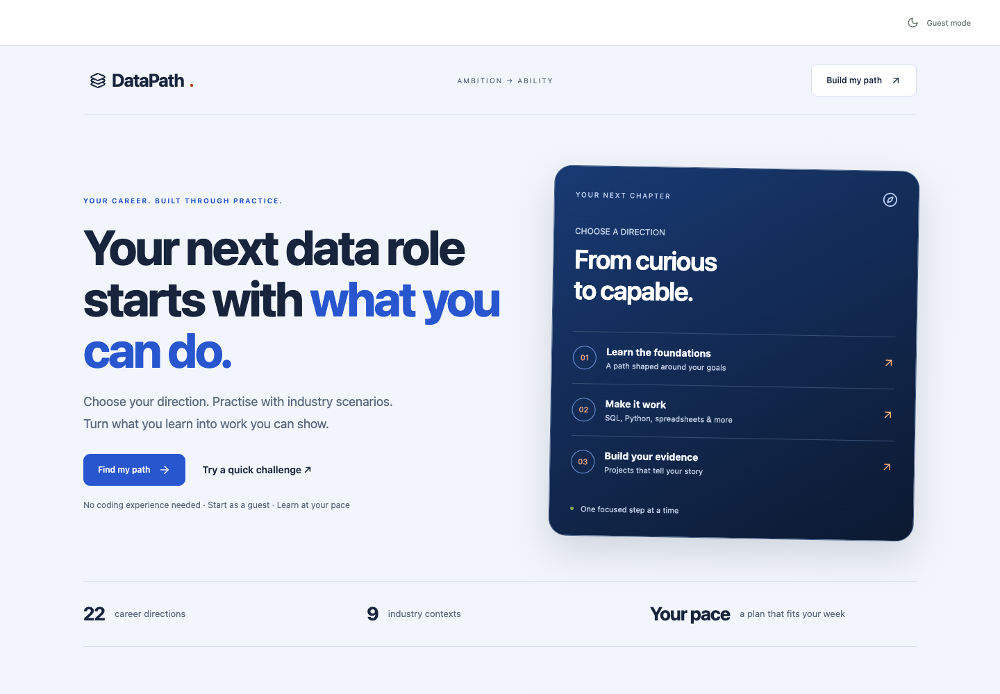

DataPath helps you choose a data career or learn one tool, skill or language. It brings a learning plan, practice, review and project preparation into one workspace. You can begin with no coding experience or build on what you already know.

Start with Find my path. If you only want a taste first, Try a quick challenge asks a small question about shop sales. That landing-page sample does not record learning progress.

This guide follows a new learner choosing Data Analyst and Banking. Your topics, examples and estimates will change with your choices. The current preview supports guest learning; account sign-in and AI need configuration before you can use them.

## Your learning journey

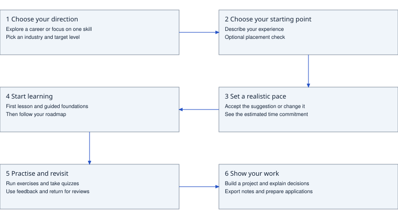

You do not need to do everything at once. Choose a direction, set a pace you can keep, and follow the next suggested activity. A beginner starts with a small table before moving into the main roadmap.

Practice and quizzes provide feedback. Reviews bring you back to topics that need attention. Projects help you explain what you can do using work that someone else can inspect.

A completed exercise or project is evidence of that activity. It is not a promise of a job or an independently awarded qualification.

## Choose a career or a focused skill

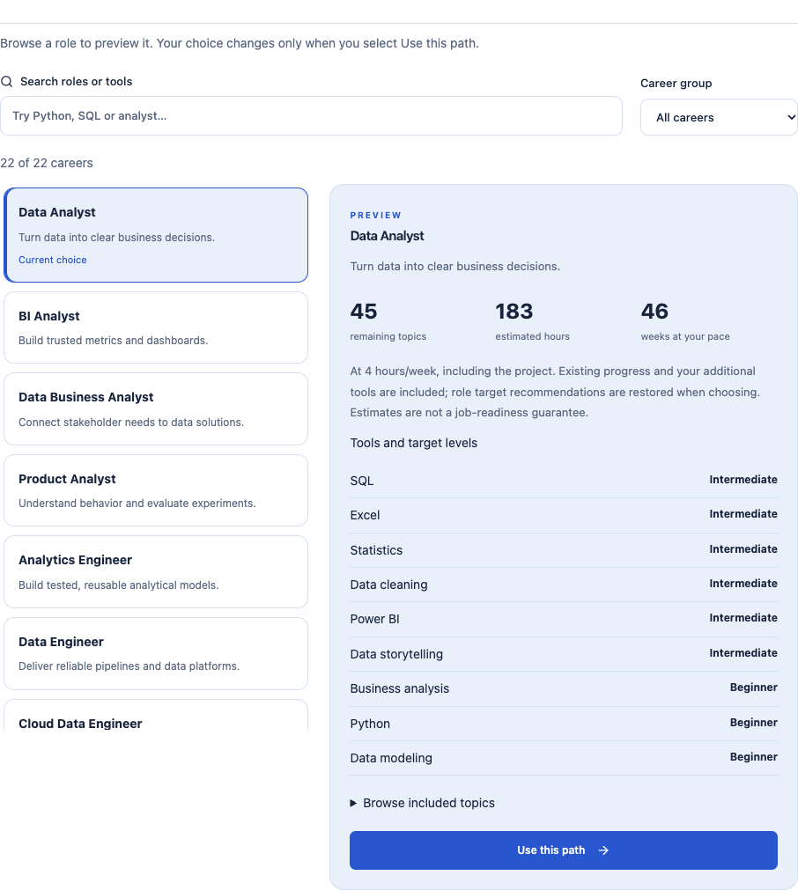

Choose Full career path for a wider set of skills, or One tool, skill or language for a focused plan. If you are unsure, use Find my fit or the beginner shortcut.

For careers, search by role or tool, filter by group, and read the preview. Select Use this path when you decide. A focused path lets you choose one skill and the depth you want to reach.

Choose your target industry so examples and project ideas are relevant to you. You can also explore before choosing an industry. Describe your experience, use the optional placement check, and adjust tools or levels if needed. Your answers help choose a starting point; they do not certify your ability.

## Set a pace you can keep

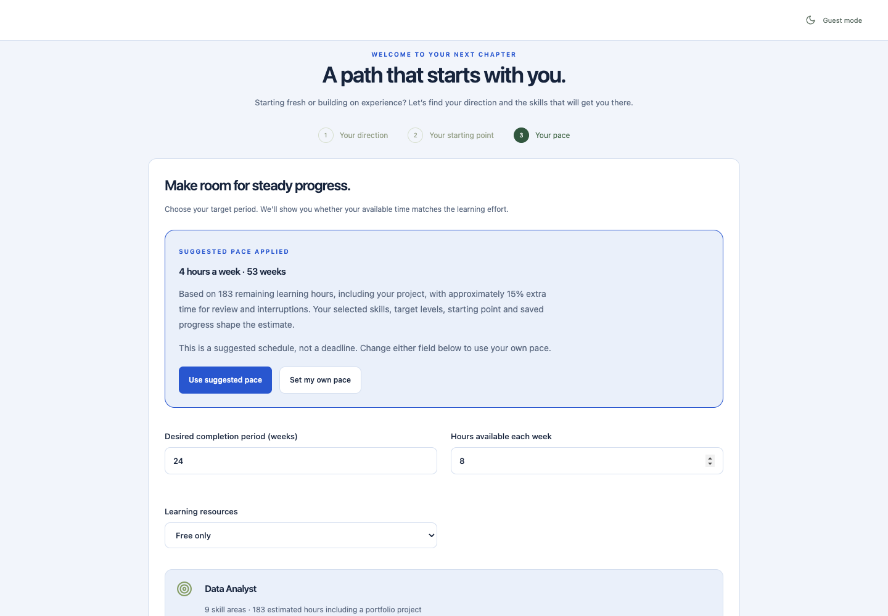

DataPath suggests weekly study time and a number of weeks based on your chosen work. The estimate allows extra time for review and interruptions. It is a planning aid, not a deadline or a prediction of exactly how fast you will learn.

Keep the suggestion, choose Set my own pace, or edit either time field. Select Free only if you want to filter out optional paid learning resources. Then choose Build my learning path.

You can change your direction and pace later. Changing a plan does not mean you have completed the lessons you remove from it.

## Find your next step

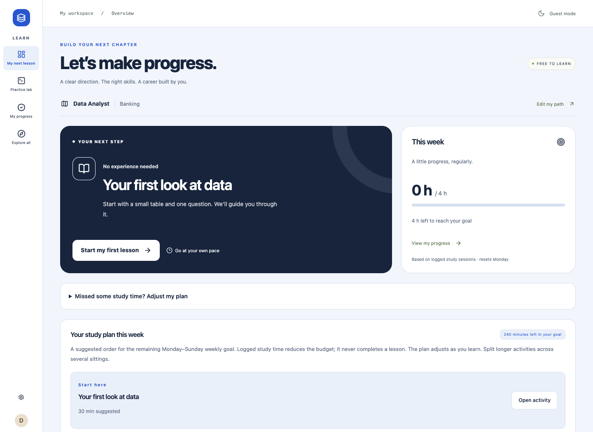

The overview shows your next suggested activity and this week's study plan. Start there when you are unsure what to do. A new learner sees Start my first lesson.

Time logged tells you how much study time you recorded. It does not complete a lesson or prove a skill. The weekly plan changes as you finish work and record study sessions.

Use Practice lab to try an exercise and My progress to review your evidence. Beginners see a shorter menu; Explore all reveals My roadmap, projects, the career toolkit and other areas.

## Complete your first lesson

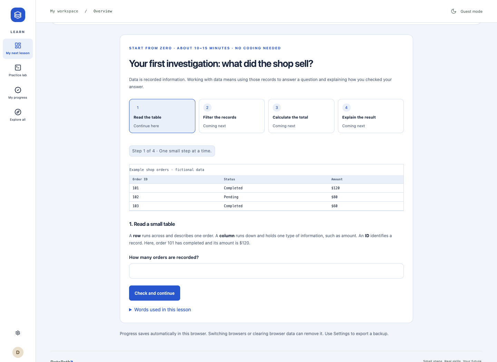

Open Start my first lesson. Read the table, choose the relevant records, calculate the total, and explain why your answer is right. Use Check and continue after each answer.

If an answer is wrong, read the explanation and try again. The lesson keeps completed steps and offers a recap, so you can resume rather than start over.

After your first achievement, continue into guided totals and averages for your industry. Work through the example, guided questions and independent task. This introductory work helps you prepare for the roadmap; it does not automatically pass its quizzes.

## Use your roadmap

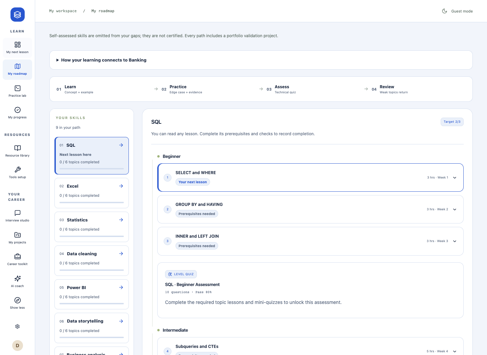

Open My roadmap and choose a skill. Expand a topic to read the lesson, examples and learning resources. Work through its steps and write your own evidence or notes rather than only ticking it off.

The page explains what you need before a topic, level assessment or skill check can be completed. Follow those requirements. If something is locked, return to the required lessons or checks.

Use Tools setup when a lesson needs software outside DataPath. Resource library helps you find additional learning material; following an external resource does not automatically record completion here.

## Practise SQL

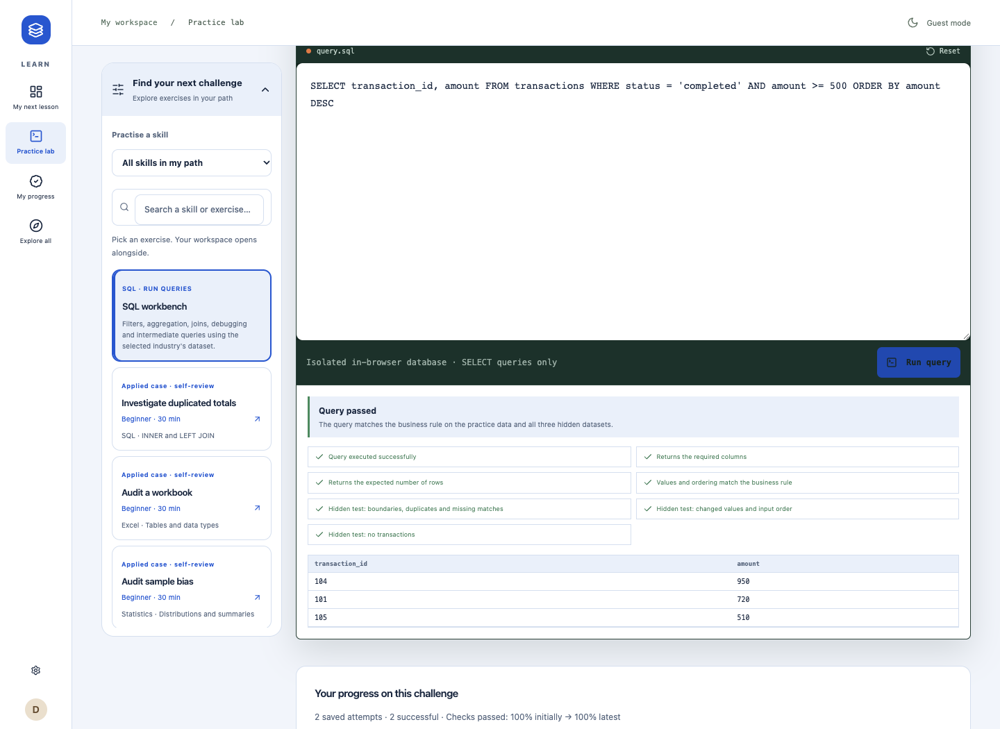

Open Practice lab. Beginners can continue guided work or choose I'm ready to explore independent exercises. Open Find your next challenge and select SQL workbench, or start the recommended exercise.

Read the task and table information. Write your query, select Run query, and compare the feedback with the request. Check filters, returned columns, totals and ordering when an answer fails.

Query passed means your answer matched the exercise checks, including alternate cases. It does not mean every possible query or dataset will work. A practice pass is separate from a topic quiz, lesson completion or a full skill check.

## Practise Python and other skills

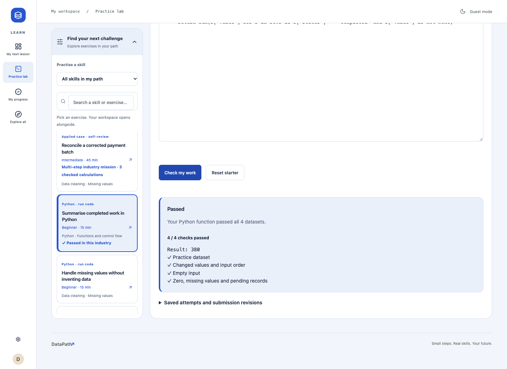

Select a Python exercise from Find your next challenge. Read the instructions and starter code, write the requested solution, then choose Check my work. The first run can take longer while the practice tools load.

Passed means your solution met this exercise's checks. If it fails, use the feedback to fix the reasoning, including empty data and missing values. Do not replace your solution with a fixed answer that only matches the example.

Other exercises include spreadsheet formulas, DAX measures, calculations and applied cases. Formula exercises support the functions described in their instructions. A self-reviewed case asks you to inspect your own work; it is different from an automatically checked pass.

## Understand quizzes and progress

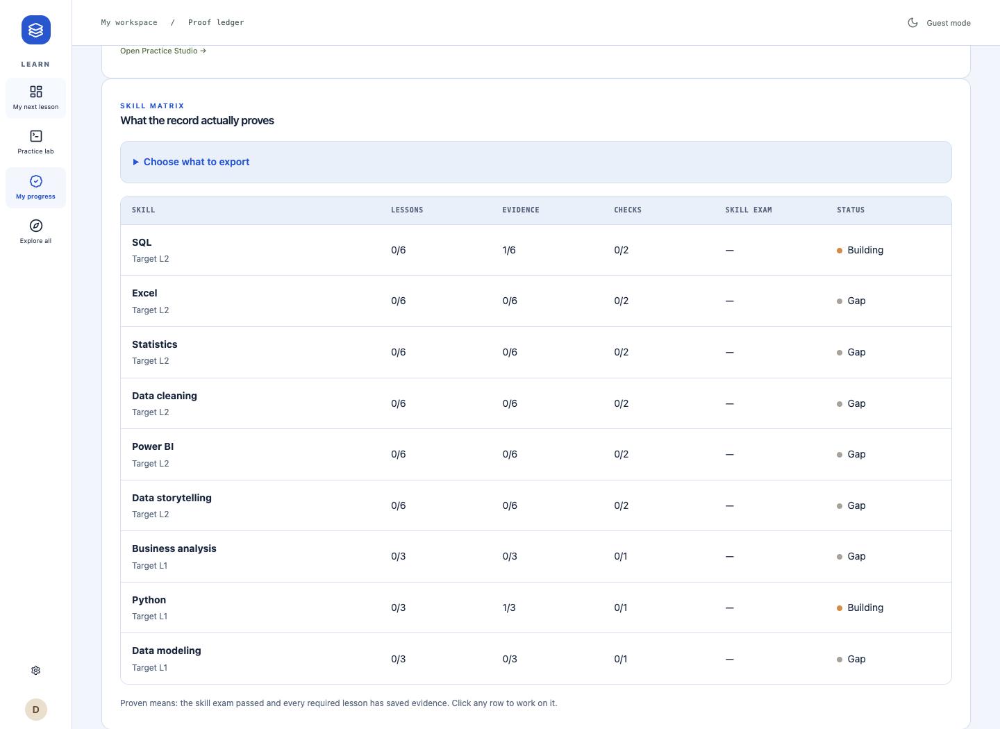

Topic and level quizzes require at least 80 percent. A full skill check requires at least 95 percent. The page shows the questions and the requirements to unlock each check. If you miss questions, revisit the related lessons and try again when ready.

My progress shows several types of evidence. An attempt is not always a pass. A note is your explanation of the work. A project completion tick is your own review. Keep those differences in mind when sharing your progress.

Choose what to export to download selected records. Share them alongside the actual work so a reviewer can understand what you did. A record from DataPath is not an independent professional credential.

## Return for review

Use review suggestions to revisit topics after learning them. Weak topics can return to your plan after a quiz, even if you previously completed them. This is a chance to close a gap, not a loss of all your work.

Scheduled review spaces successful checks over time. Do the suggested review when it is due and pay attention to feedback. Repeating a successful check several times on the same day does not replace returning later.

If the plan feels too heavy, use the option to adjust your study plan after missed time. A lighter schedule changes the pace; it does not silently pass unfinished lessons.

For interview preparation, Explore all opens Interview studio. Choose a question, write an answer and compare it with the review criteria. Download your journal to keep your answers. Optional AI feedback requires sign-in, configuration and consent.

## Build a portfolio project

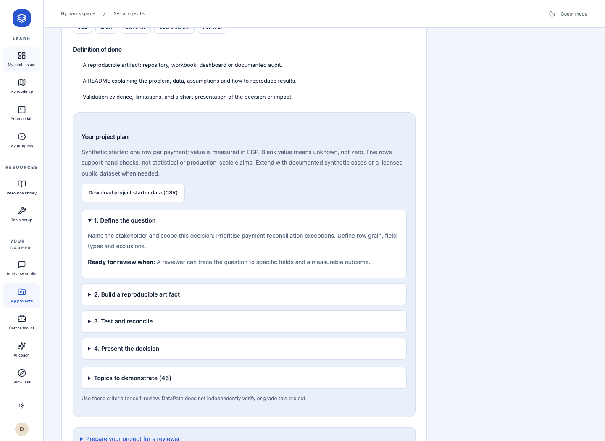

Open My projects. Read the brief, industry context and definition of done. Follow the milestones: define the question, build a reproducible piece of work, test the result and explain the decision.

Download project starter data if useful. It is a small fictional example, not proof of a real business result. Some suggested measures need more data than the starter contains. Record missing information instead of inventing values.

Create the actual workbook, report, code or other work in the appropriate tools. Add evidence, links and reflection in the project notes. DataPath does not independently grade the finished project.

## Export and share your project

Add project notes first. Then open Prepare your project for a reviewer and check the items you have actually addressed: question, data, method, validation, conclusion and accessible links.

Choose Download notes and checklist to keep the notes and your current checks in a text document. Those preparation checks last for the visit, so download them if you need a lasting copy. Use Download project starter data for a separate copy of the practice data.

Share your exported notes together with the actual work. A notes download does not package or publish the linked workbook, dashboard or code. Make sure the intended reviewer can open those links and that you have permission to share the data.

Only mark the project complete when you have delivered and checked its requirements. The completion mark records your own assessment. It does not create an independently verified certificate.

## Prepare your CV and applications

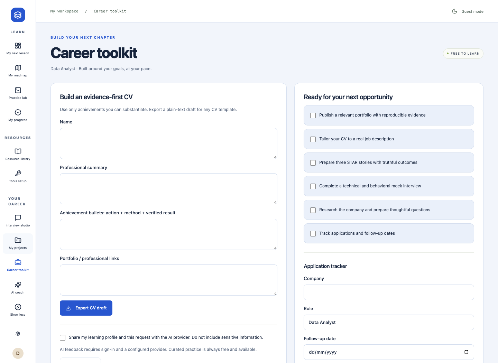

Open Career toolkit. Enter your name, summary, truthful achievements and portfolio links. Describe what you did and how you checked it. Use Export CV draft to download plain text you can place into your preferred CV design.

Use the opportunity checklist to prepare your portfolio, interview stories and company research. Add a company, role and follow-up date to Application tracker, then update its status as you make progress.

The tracker records your entries. It does not send applications, contact employers or promise reminders outside the app. Review with AI is optional and unavailable until account access and a provider are configured.

## Use the optional AI coach

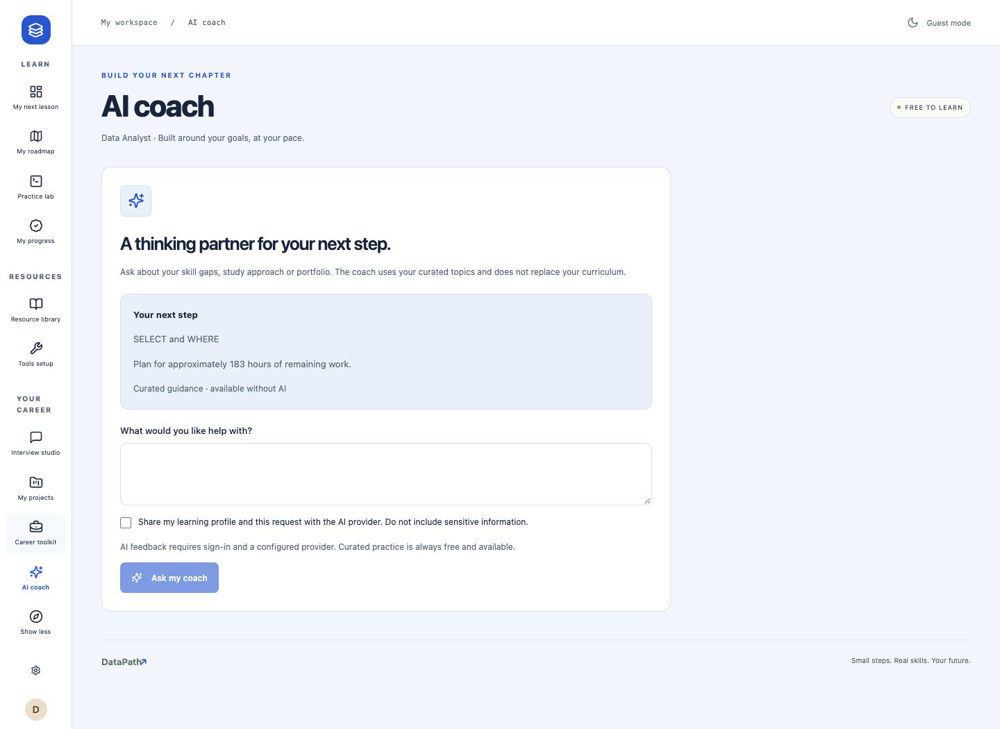

AI coach offers optional help with study questions, skill gaps and project ideas. The suggested next step shown as Curated guidance remains available without AI.

When AI is available, sign in, read the sharing notice, choose whether to consent and enter your question. Do not include sensitive information. The coach may also help with interview reflection or CV wording through those areas.

Treat a reply as advice and check it against your lessons and actual work. It does not independently certify skills, complete your curriculum or guarantee employment. Live AI answer quality has not been verified for this edition.

## Save your work safely

Guest mode saves automatically in this browser. Use Settings and profile, then Export progress, to download a backup regularly. A different browser or device will not automatically have that work. Clearing browser data can remove it.

When accounts are available, sign in and use Save progress. Wait for the saved confirmation before leaving. Account saving is an explicit action, so do not assume every edit has already reached your account.

Guest work and account work are separate. Signing in does not silently copy guest progress into an account. Use the explicit import option in Settings if you want to replace the account workspace with guest work, then save.

Import backup replaces the current workspace after confirmation. Export anything you want to keep first. In the local preview captured here, accounts are unavailable because they have not been configured.

## Questions and troubleshooting

Why did my save conflict? Another tab or session may have saved a newer version. Export your current work before reloading. Reload the saved version, carefully reapply the changes you still need, then save again. DataPath does not automatically combine conflicting edits.

What if I switch browsers as a guest? Your work stays in the original browser. Export a backup there and import it into the new browser. Without a backup or an account save, the app cannot recover cleared guest data.

Why is an assessment locked? Complete the required lessons and earlier checks shown on the page. A self-assessed starting level or a practice attempt does not replace those requirements.

Why did the code exercise time out? Check the instructions, simplify the solution and avoid loops that never end. Retry once the practice tools finish loading. If the problem continues, keep a copy of your answer and report the exercise name and visible message.

Why is AI unavailable? It needs sign-in and configuration, and can also stop temporarily because of usage limits or a service problem. Continue with the lessons and curated practice. Do not assume the app has lost your work.

Why is a project or CV export missing my finished files? Exports contain the notes or draft described by the button. Keep and share the actual project files separately.

Where did a skill go after I changed paths? The view follows your current direction and industry. Return to the relevant path to inspect its records. Export a backup before major changes, and review the new plan carefully.
